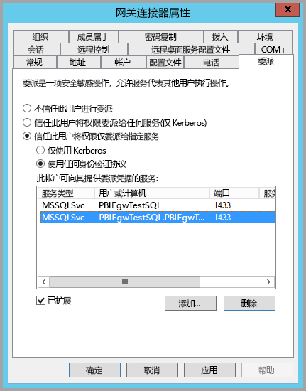
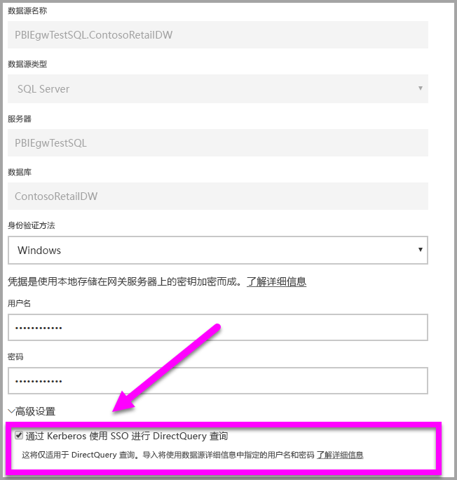
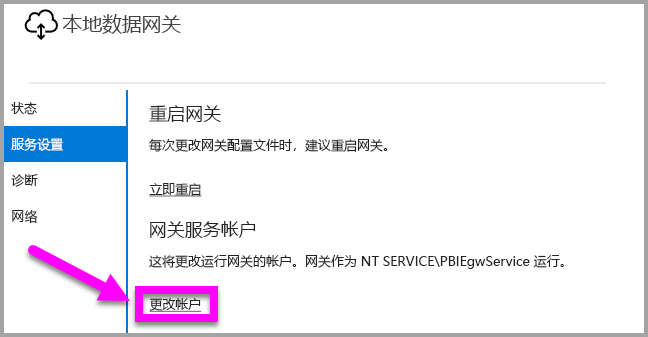
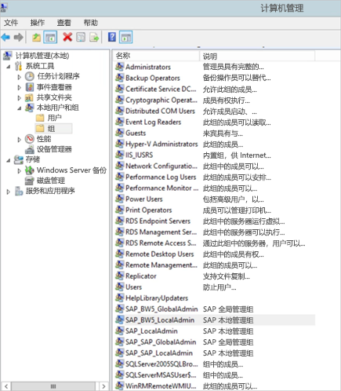
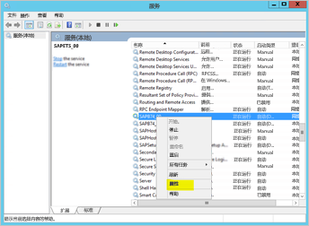
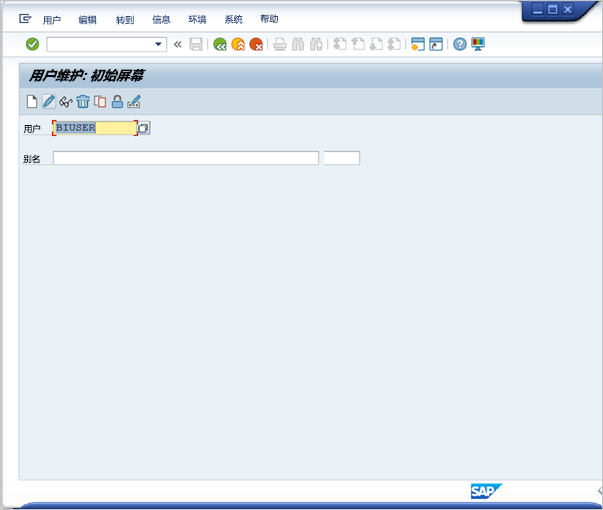
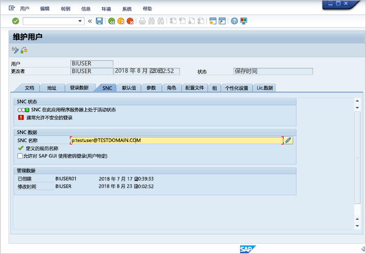
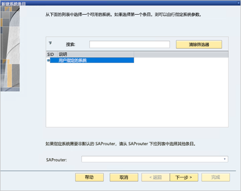
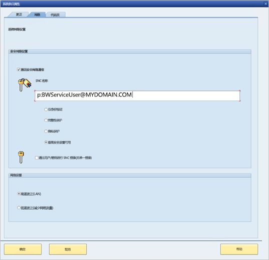
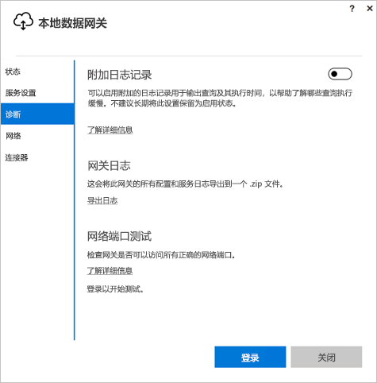

# <a name="use-kerberos-for-single-sign-on-sso-from-power-bi-to-on-premises-data-sources"></a>使用 Kerberos 进行从 Power BI 到本地数据源的单一登录 (SSO)

使用 [Kerberos 约束委派](/windows-server/security/kerberos/kerberos-constrained-delegation-overview)启用无缝单一登录 (SSO) 连接。 启用 SSO 后，Power BI 报表和仪表板可以轻松通过本地源刷新数据。

## <a name="supported-data-sources"></a>支持的数据源

目前支持以下数据源：

* SQL Server
* SAP HANA
* SAP BW
* Teradata
* Spark
* Impala

我们还通过[安全断言标记语言 (SAML)](service-gateway-sso-saml.md) 支持 SAP HANA。

### <a name="sap-hana"></a>SAP HANA

要为 SAP HANA 启用 SSO，请首先按照以下步骤操作：

* 确保当前运行的 SAP HANA 服务器具备所需的最低版本（版本取决于 SAP HANA 服务器平台级别）：
  * [HANA 2 SPS 01 Rev 012.03](https://launchpad.support.sap.com/#/notes/2557386)
  * [HANA 2 SPS 02 Rev 22](https://launchpad.support.sap.com/#/notes/2547324)
  * [HANA 1 SP 12 Rev 122.13](https://launchpad.support.sap.com/#/notes/2528439)
* 在网关计算机上，安装 SAP 的最新 HANA ODBC 驱动程序。  最低版本为 2017 年 8 月发布的 HANA ODBC 版本 2.00.020.00。

有关使用 Kerberos 为 SAP HANA 设置 SSO 的详细信息，请参阅“SAP HANA 安全指南”中的[使用 Kerberos 进行单一登录](https://help.sap.com/viewer/b3ee5778bc2e4a089d3299b82ec762a7/2.0.03/1885fad82df943c2a1974f5da0eed66d.html)。 另请参阅该页面的链接，特别是 SAP 注释 1837331 - HOWTO HANA DBSSO Kerberos/Active Directory。

## <a name="prepare-for-kerberos-constrained-delegation"></a>准备 Kerberos 约束委派

必须配置多个项才能使 Kerberos 约束委派正常工作，其中包括服务主体名称 (SPN) 和服务帐户上的委派设置。

### <a name="prerequisite-1-install-and-configure-the-microsoft-on-premises-data-gateway"></a>先决条件 1：安装并配置 Microsoft 本地数据网关

此版本的本地数据网关支持就地升级，以及现有网关的设置接管。

### <a name="prerequisite-2-run-the-gateway-windows-service-as-a-domain-account"></a>先决条件 2：将网关 Windows 服务作为域帐户运行

在标准安装中，网关作为计算机本地服务帐户（具体而言，NT Service\PBIEgwService）运行。


若要启用 Kerberos 约束委派，网关必须作为域帐户运行，除非 Azure Active Directory (Azure AD) 实例已与本地 Active Directory 实例同步（使用 Azure AD DirSync/Connect）。 若要切换到域帐户，请参阅本文后面的[将网关切换到域帐户](#switch-the-gateway-to-a-domain-account)。

> [!NOTE]
> 如果配置了 Azure AD Connect 并且用户帐户已同步，则网关服务不需要在运行时执行本地 Azure AD 查找。 可以将本地服务 SID（而不是请求域帐户）用于网关服务。 本文所述的 Kerberos 约束委派配置步骤与该配置相同。 它们仅应用于 Azure AD 中网关的计算机对象，而不是域帐户。

### <a name="prerequisite-3-have-domain-admin-rights-to-configure-spns-setspn-and-kerberos-constrained-delegation-settings"></a>先决条件 3：具有域管理员权限才能配置 SPN (SetSPN) 和 Kerberos 约束委派设置

不建议域管理员暂时或永久地允许不具有域管理员权限的其他人配置 SPN 和 Kerberos 委派。 在下一部分中，我们将更详细地介绍建议的配置步骤。

## <a name="configure-kerberos-constrained-delegation-for-the-gateway-and-data-source"></a>为网关和数据源配置 Kerberos 约束委派

以域管理员身份，为网关服务域帐户配置 SPN，并在网关服务域帐户上配置委托设置。

### <a name="configure-an-spn-for-the-gateway-service-account"></a>为网关服务帐户配置 SPN

首先，确定是否已经为用作网关服务帐户的域帐户创建了 SPN：

1. 以域管理员身份打开“Active Directory 用户和计算机”。

2. 右键单击该域，选择“查找”，然后输入网关服务帐户的帐户名。

3. 在搜索结果中，右键单击网关服务帐户，然后选择“属性”。

4. 如果“属性”对话框中可以看到“委派”选项卡，表示已创建 SPN。 你可以跳到配置委派设置这一步。

    如果“属性”对话框中没有“委派”选项卡，可以在该帐户上手动创建 SPN。 这将添加“委派”选项卡。请使用 Windows 附带的 [setspn 工具](https://technet.microsoft.com/library/cc731241.aspx)（需要域管理员权限才能创建 SPN）。

    例如，假设网关服务帐户为“PBIEgwTest\GatewaySvc”，并且运行网关服务的计算机名为 Machine1。 若要在此示例中为该计算机的网关服务帐户设置 SPN，请运行以下命令：

    

    完成该步骤后，我们可以继续配置委派设置。

### <a name="configure-delegation-settings-on-the-gateway-service-account"></a>在网关服务帐户上配置委派设置

第二个配置要求是网关服务帐户上的委派设置。 有多种工具可以用来执行这些步骤。 在此，我们将使用 Active Directory 用户和计算机，它是一个 Microsoft 管理控制台 (MMC) 管理单元，用于管理和发布目录中的信息。 默认在域控制器上可用。 也可以通过其他计算机上的“Windows 功能”配置来启用它。

我们需要通过协议转换来配置“Kerberos 约束委派”。 使用约束委派时，必须要明确要委派哪些服务。 例如，只有 SQL Server 或 SAP HANA 服务器接受网关服务帐户的委派调用。

本节假定你已经为基础数据源（例如 SQL Server、SAP HANA、Teradata 和 Spark）配置了 SPN。 要了解如何配置这些数据源服务器 SPN，请参阅相应数据库服务器的技术文档。 还可以参阅博客文章 [What SPN does your app require?](https://blogs.msdn.microsoft.com/psssql/2010/06/23/my-kerberos-checklist/)（应用需要的 SPN 是什么？）。

在以下步骤中，我们假设本地环境中有两台计算机：网关计算机和运行 SQL Server 数据库的服务器。 针对本示例，我们还假设以下设置和名称：

* 网关计算机名：PBIEgwTestGW
* 网关服务帐户：PBIEgwTest\GatewaySvc（帐户显示名称：网关连接器）
* SQL Server 数据源计算机名：PBIEgwTestSQL
* SQL Server 数据源服务帐户：PBIEgwTest\SQLService

下面是配置委派设置的方法：

1. 通过域管理员权限，打开“Active Directory用户和计算机”。

2. 右键单击网关服务帐户 (PBIEgwTest\GatewaySvc)，然后选择“属性”。

3. 选择“**委派**”选项卡。

4. 选择“仅信任此计算机来委派指定的服务” > “使用任意身份验证协议”。

6. 在“可以由此帐户提供委派凭据的服务”下选择“添加”。

7. 在新对话框中，选择“用户或计算机”。

8. 输入 SQL Server 数据源 (PBIEgwTest\SQLService) 的服务帐户，然后选择“确定”。

9. 选择你为数据库服务器创建的 SPN。 在我们的示例中，SPN 以“MSSQLSvc”开头。 如果你为数据库服务添加了 FQDN 和 NetBIOS SPN，请同时选择两者。 你可能只看到一个。

10. 选择**确定**。 现在，列表中应该会显示 SPN。

    或者，你可以选择“已展开”以在以下位置同时显示 FQDN 和 NetBIOS SPN。 如果选择了“已展开”，则对话框如下所示。 选择**确定**。

    

最后，必须在运行网关服务（在示例中为 PBIEgwTestGW）的计算机上授予网关服务帐户本地策略“身份验证后模拟客户端”。 可以使用本地组策略编辑器 (gpedit) 执行和验证此操作。

1. 在网关计算机上运行：gpedit.msc。

1. 转到“本地计算机策略” > “计算机配置” > “Windows 设置” > “安全设置” > “本地策略” > “用户权限分配”。

    

1. 从“用户权限分配”下的策略列表中，选择“身份验证后模拟客户端”。

    

    右键单击，然后打开“属性”。 查看帐户列表。 其中必须包括网关服务帐户 (PBIEgwTest\GatewaySvc)。

1. 从“用户权限分配”下的策略列表中，选择“以操作系统方式执行”(SeTcbPrivilege)。 确保网关服务帐户也包括在帐户列表中。

1. 重启“本地数据网关”服务进程。

如果使用 SAP HANA，我们建议执行以下附加步骤，这些步骤可以小幅度提升性能。

1. 在网关安装目录中找到并打开此配置文件：Microsoft.PowerBI.DataMovement.Pipeline.GatewayCore.dll.config。

1. 找到“FullDomainResolutionEnabled”属性，并将其值更改为“True”。

    ```xml
    <setting name=" FullDomainResolutionEnabled " serializeAs="String">
          <value>True</value>
    </setting>
    ```

## <a name="run-a-power-bi-report"></a>运行 Power BI 报表

完成所有配置步骤后，可以使用 Power BI 中的“管理网关”页面来配置数据源。 然后在其“高级设置”下启用 SSO，并发布绑定到该数据源的报表和数据集。



在大多数情况下，此配置有效。 但是，使用 Kerberos 时，根据你的环境可以有不同的配置。 如果报表仍无法加载，请联系你的域管理员进一步调查。

## <a name="switch-the-gateway-to-a-domain-account"></a>将网关切换到域帐户

如有必要，可以使用“本地数据网关”用户界面，将网关从本地服务帐户切换为作为域帐户运行。 下面介绍如何操作：

1. 打开“本地数据网关”配置工具。

   

2. 选择主页上的“登录”按钮，然后使用你的 Power BI 帐户登录。

3. 登录完成后，选择“服务设置”选项卡。

4. 选择“更改帐户”启动操作引导说明。

   

## <a name="configure-sap-bw-for-sso"></a>为 SSO 配置 SAP BW

了解了 Kerberos 如何与网关配合使用后，接下来可以为 SAP Business Warehouse (SAP BW) 配置 SSO。 以下步骤假设你已经[为 Kerberos 约束委派做好了准备](#prepare-for-kerberos-constrained-delegation)（如本文前面部分所述）。

本指南尝试尽可能全面地进行介绍。 如果你已经完成了其中的一些步骤，则可以跳过这些步骤。 例如，你可能已经为 SAP BW 服务器创建了一个服务用户并已将 SPN 映射到它，或者已安装了 `gsskrb5` 库。

### <a name="set-up-gsskrb5-on-client-machines-and-the-sap-bw-server"></a>在客户端计算机和 SAP BW 服务器上设置 gsskrb5

> [!NOTE]
> SAP 不再主动支持 `gsskrb5`。 有关详细信息，请参阅 [SAP 备注 352295](https://launchpad.support.sap.com/#/notes/352295)。 另请注意，`gsskrb5` 不允许从数据网关到 SAP BW 消息服务器的 SSO 连接。 仅可连接到 SAP BW 应用程序服务器。

客户端和服务器必须使用 `gsskrb5` 才能通过网关完成 SSO 连接。 目前不支持 Common Crypto Library (sapcrypto)。

1. 从 [SAP 注释 2115486](https://launchpad.support.sap.com/) 下载 `gsskrb5` - `gx64krb5`（需要是 SAP 用户）。 请确保至少有 1.0.11.x 版本的 gsskrb5.dll 和 gx64krb5.dll。

1. 将库放在网关计算机上可由网关实例访问的位置（如果要使用 SAP Logon 测试 SSO 连接，还需要 SAP GUI 可以访问该位置）。

1. 将另一个副本放在 SAP BW 服务器计算机上的可由 SAP BW 服务器访问的位置。

1. 在客户端和服务器计算机上，将 `SNC\_LIB` 和 `SNC\_LIB\_64` 环境变量分别设置为指向 gsskrb5.dll 和 gx64krb5.dll 的位置。

### <a name="create-a-sap-bw-service-user-and-enable-snc-communication"></a>创建 SAP BW 服务用户并启用 SNC 通信

除了已经完成的网关配置之外，还有一些特定于 SAP BW 的额外步骤。 文档中的[在网关服务帐户上配置委派设置](#configure-delegation-settings-on-the-gateway-service-account)部分假设你已为基础数据源配置了 SPN。 要为 SAP BW 完成此配置：

1. 在 Active Directory 域控制器服务器上，为 Active Directory 环境中的 SAP BW 应用程序服务器创建服务用户（最初只是普通的 Active Directory 用户）。 然后为其分配 SPN。

    SAP 建议使用 `SAP/` 启动 SPN，但应该也能使用其他前缀，例如 `HTTP/`。 `SAP/` 之后的内容可自行决定；一种选择是使用 SAP BW 服务器服务用户的用户名。 例如，如果你将 `BWServiceUser@\<DOMAIN\>` 创建为服务用户，则可以使用 SPN `SAP/BWServiceUser`。 设置 SPN 映射的一种方法是使用 setspn 命令。 例如，要在我们刚创建的服务用户上设置 SPN，需要从域控制器计算机上的 cmd 窗口中运行以下命令：`setspn -s SAP/ BWServiceUser DOMAIN\ BWServiceUser`。 有关详细信息，请参阅 SAP BW 文档。

1. 授予服务用户访问 SAP BW 应用程序服务器的权限：

    1. 在 SAP BW 服务器计算机上，将服务用户添加到 SAP BW 服务器的“本地管理员”组。 打开“计算机管理”程序，然后双击服务器的“本地管理员”组。

        

    1. 双击“本地管理员”组，然后选择“添加”，将服务用户添加到该组。 选择“检查姓名”以确保输入的名称正确无误。 选择**确定**。

1. 将 SAP BW 服务器的服务用户设置为在 SAP BW 服务器计算机上启动 SAP BW 服务器服务的用户。

    1. 打开“运行”，并输入“Services.msc”。 查找与 SAP BW 应用程序服务器实例对应的服务。 右键单击它，然后选择“属性”。

        

    1. 切换到“登录”选项卡，将用户更改为 SAP BW 服务用户。 输入用户的密码，然后选择“确定”。

1. 在 SAP Logon 中登录服务器，并使用 RZ10 事务设置以下配置文件参数：

    1. 将 snc/identity/as 配置文件参数设置为：p:\<已创建的 SAP BW 服务用户\>，例如 p:BWServiceUser@MYDOMAIN.COM。 请注意服务用户 UPN 之前的“p:”。 它不是将 Common Crypto Lib 作为 SNC 库使用时所用的 p:CN=。

    1. 将 snc/gssapi\_lib 配置文件参数设置为\<服务器计算机上 gsskrb5.dll/gx64krb5.dll 的路径（要使用的库取决于操作系统位数）\>。 请务必将库放在 SAP BW 应用程序服务器可以访问的位置。

    1. 还可以设置以下额外加配置文件参数，并根据需要更改值。 请注意，最后五个选项使客户端无需配置 SNC 即可使用 SAP Logon 连接到 SAP BW 服务器。

        | 设置 | 值 |
        | --- | --- |
        | snc/data\_protection/max | 3 |
        | snc/data\_protection/min | 1 |
        | snc/data\_protection/use | 9 |
        | snc/accept\_insecure\_cpic | 1 |
        | snc/accept\_insecure\_gui | 1 |
        | snc/accept\_insecure\_r3int\_rfc | 1 |
        | snc/accept\_insecure\_rfc | 1 |
        | snc/permit\_insecure\_start | 1 |

    1. 将属性 snc/enable 设置为 1。

1. 设置这些配置文件参数后，在服务器计算机上打开 SAP 管理控制台并重启 SAP BW 实例。 如果服务器无法启动，请确认已正确设置了配置文件参数。 有关配置文件参数设置的详细信息，请参阅 [SAP 文档](https://help.sap.com/saphelp_nw70ehp1/helpdata/en/e6/56f466e99a11d1a5b00000e835363f/frameset.htm)。 如果遇到问题，还可以参考本节后面的故障排除信息。

### <a name="map-a-sap-bw-user-to-an-active-directory-user"></a>将 SAP BW 用户映射到 Active Directory 用户

将 Active Directory 用户映射到 SAP BW 应用程序服务器用户，并在 SAP Logon 中测试 SSO 连接。

1. 使用 SAP Logon 登录 SAP BW 服务器。 运行事务 SU01。

1. 对于“用户”，输入要为其启用 SSO 连接的 SAP BW 用户（先前的屏幕截图显示的是为 BIUSER 设置权限）。 选择 SAP Logon 窗口左上角附近的“编辑”图标（笔形图片）。

    

1. 选择“SNC”选项卡。在 SNC 名称输入框中，输入 p:\<你的 Active Directory 用户\>@\<你的域\>。 请注意，必须在 Active Directory 用户的 UPN 之前加“p:”。 指定的 Active Directory 用户应是要为其启用 SSO 访问 SAP BW 应用程序服务器的人员或组织。 例如，如果要为用户 [testuser@TESTDOMAIN.COM](mailto:testuser@TESTDOMAIN.COM) 启用 SSO 访问权限，请输入 p:testuser@TESTDOMAIN.COM。

    

1. 选择屏幕左上角附近的“保存”图标（软盘图像）。

### <a name="test-sign-in-by-using-sso"></a>使用 SSO 测试登录

确认可以登录到服务器。 以刚为其启用了 SSO 访问权限的 Active Directory 用户的身份，通过 SSO 使用 SAP Logon。

1. 以刚为其启用了 SSO 访问权限的 Active Directory 用户的身份登录到安装了 SAP Logon 的计算机。 启动 SAP Logon，并创建新连接。

1. 在“创建新系统条目”屏幕中，选择“用户指定的系统” > “下一步”。

    

1. 在下一屏上填写相应的详细信息，包括应用程序服务器、实例编号和系统 ID。 然后选择“完成”。

1. 右键单击新连接，然后选择“属性”。 选择“网络”选项卡。在“SNC 名称”文本框中，输入 p:\<SAP BW 服务用户的 UPN\>，例如 p:BWServiceUser@MYDOMAIN.COM。 然后，选择“确定”。

    

1. 双击刚才创建的连接，尝试与 SAP BW 服务器建立 SSO 连接。 如果连接成功，请继续执行下一步。 否则，请查看本文档中先前的步骤以确保它们已正确完成，或查看下面的故障排除部分。 请注意，如果在此上下文中无法通过 SSO 连接到 SAP BW 服务器，则无法在网关上下文中使用 SSO 连接到 SAP BW 服务器。

### <a name="troubleshoot-installation-and-connections"></a>安装和连接故障排除

如果遇到任何问题，请按照以下步骤对 SAP Logon 中的 gsskrb5 安装和 SSO 连接进行故障排除。

- 查看服务器日志（位于服务器计算机上的 …work\dev\_w0）可以帮助你对完成 gsskrb5 设置步骤期间遇到的任何错误进行故障排除。 如果在更改配置文件参数后 SAP BW 服务器无法启动，则尤其如此。

- 如果由于“登录失败”而无法启动 SAP BW 服务，则在设置 SAP BW“启动”用户时可能提供了错误密码。 通过以 SAP BW 服务用户身份登录 Active Directory 环境中的计算机来验证密码。

- 如果收到有关阻止服务器启动的 SQL 凭据的错误，请验证是否已为服务用户授予了 SAP BW 数据库的访问权限。

- 你可能会收到以下消息：“(GSS-API) 指定的目标未知或无法访问。” 这通常意味着你指定了错误的 SNC 名称。 在客户端应用程序中，确保除服务用户的 UPN 之外，仅使用“p:”，而不是“p:CN=”或任何其他内容。

- 你可能会收到以下消息：“(GSS-API) 提供了无效的名称。” 确保“p:”在服务器的 SNC 标识配置文件参数的值中。

- 你可能会收到以下消息：“（SNC 错误）无法找到指定的模块。” 这通常是由于将 `gsskrb5.dll/gx64krb5.dll` 放到了需要提升的权限（管理员权限）才能访问的位置。

### <a name="add-registry-entries-to-the-gateway-machine"></a>将注册表项添加到网关计算机

将所需的注册表项添加到安装网关的计算机的注册表中。 下面是要运行的命令：

1. REG ADD HKLM\SOFTWARE\Wow6432Node\SAP\gsskrb5 /v ForceIniCredOK /t REG\_DWORD /d 1 /f

1. REG ADD HKLM\SOFTWARE\SAP\gsskrb5 /v ForceIniCredOK /t REG\_DWORD /d 1 /f

### <a name="set-configuration-parameters-on-the-gateway-machine"></a>设置网关计算机上的配置参数

设置配置参数有两种选择，具体取决于你是否配置了 Azure AD Connect，以便用户能以 Azure AD 用户身份登录 Power BI 服务。

如果已配置 Azure AD Connect，请按照下列步骤操作。

1. 打开主网关配置文件 `Microsoft.PowerBI.DataMovement.Pipeline.GatewayCore.dll`。 默认情况下，此文件存储在 C:\Program Files\On-premises data gateway。

1. 请务必将“FullDomainResolutionEnabled”属性设置为 True，将“SapHanaSsoRemoveDomainEnabled”属性设置为 False。

1. 保存配置文件。

1. 在任务管理器的“服务”选项卡中，右键单击网关服务，然后选择“重启”。

    

如果未配置 Azure AD Connect，请为要映射到 Azure AD 用户的所有 Power BI 服务用户执行以下步骤。 以下步骤会将 Power BI Service 用户手动链接到具有登录 SAP BW 的权限的 Active Directory 用户。

1. 打开主网关配置文件 `Microsoft.PowerBI.DataMovement.Pipeline.GatewayCore.dll`。 默认情况下，此文件存储在 C:\Program Files\On-premises data gateway。

1. 将“ADUserNameLookupProperty”设置为 `msDS-cloudExtensionAttribute1`，将“ADUserNameReplacementProperty”设置为 `SAMAccountName`。 保存配置文件。

1. 在任务管理器的“服务”选项卡中，右键单击网关服务，然后选择“重启”。

    

1. 设置 Active Directory 用户的 `msDS-cloudExtensionAttribute1` 属性。 这是映射到 SAP BW 用户的用户。 为要为其启用 Kerberos SSO 的 Power BI 服务用户设置该属性。 设置 `msDS-cloudExtensionAttribute1` 属性的一种方法是使用“Active Directory 用户和计算机”MMC 管理单元。 （你也可以使用其他方法。）

    1. 以管理员用户身份登录到域控制器计算机。

    1. 在管理单元窗口中打开“用户”文件夹，然后双击映射到 SAP BW 用户的 Active Directory 用户。

    1. 选择“属性编辑器”选项卡。

        如果没有看到此选项卡，则需要搜索有关如何启用它的说明，或使用其他方法设置属性。 选择其中一个属性，然后选择 M 键，转到以字母 m 开头的 Active Directory 属性。 找到 `msDS-cloudExtensionAttribute1` 属性，然后双击它。 将值设置为用于登录 Power BI 服务的用户名，格式为 YourUser@YourDomain。

    1. 选择**确定**。

        

    1. 选择**应用**。 验证是否已在“值”列中设置了正确的值。

### <a name="add-a-new-sap-bw-application-server-data-source-to-the-power-bi-service"></a>将新的 SAP BW 应用程序服务数据源添加到 Power BI 服务

按照本文前面有关[运行报告](#run-a-power-bi-report)的说明将 SAP BW 数据源添加到网关。

1. 在数据源配置窗口中，与从 Power BI Desktop 登录到 SAP BW 服务器一样，输入应用程序服务器的“主机名”、“系统编号”和”客户端 ID”。 对于“身份验证方法”，选择“Windows”。

1. 在“SNC 合作伙伴名称”字段中，输入 p:\<映射到 SAP BW 服务用户的 SPN\>。 例如，如 SPN 为 SAP/BWServiceUser@MYDOMAIN.COM，则应在“SNC 合作伙伴名称”字段中输入 p:SAP/BWServiceUser@MYDOMAIN.COM。

1. 对于 SNC 库，请选择“SNC\_LIB”或“SNC\_LIB\_64”。

1. “用户名”和“密码”应为有权使用 SSO 登录 SAP BW 服务器的 Active Directory 用户的用户名和密码。 换句话说，它们应属于通过 SU01 事务映射到 SAP BW 用户的 Active Directory 用户。 仅当未选中“通过 Kerberos 使用 SSO 执行 DirectQuery 查询”框时，才会使用这些凭据。

1. 勾选“通过 Kerberos 使用 SSO 执行 DirectQuery 查询”框并选择“应用”。 如果测试连接不成功，请验证先前的设置和配置步骤是否已正确完成。

    网关始终使用键入的凭据建立与服务器的测试连接，并执行基于导入的报表的计划刷新。 如果勾选了“通过 Kerberos 使用 SSO 执行 DirectQuery 查询”，并且用户正在访问基于直接查询的报表或数据集，则网关仅尝试建立 SSO 连接。

### <a name="test-your-setup"></a>测试设置

将 Power BI Desktop 中的 DirectQuery 报表发布到 Power BI 服务以测试设置。 确保以 Azure AD 用户或已映射到 Azure AD 用户的 `msDS-cloudExtensionAttribute1` 属性的用户的身份登录 Power BI 服务。 如果设置成功完成，应该能够从 Power BI 服务中发布的数据集创建报表。 还应能够通过报表中的视觉对象拉取数据。

### <a name="troubleshoot-gateway-connectivity-issues"></a>网关连接问题故障排除

1. 检查网关日志。 打开网关配置应用程序，选择“诊断” > “导出日志”。 最新错误位于检查的任何日志文件的底部。

    

1. 打开 SAP BW 跟踪并查看生成的日志文件。 可使用多种不同类型的 SAP BW 跟踪。 有关详细信息，请参阅 SAP 文档。

## <a name="errors-from-an-insufficient-kerberos-configuration"></a>Kerberos 配置不全导致的错误

如果没有为 Kerberos 约束委派正确配置基础数据库服务器和网关，则可能会收到以下有关无法加载数据的错误消息：


与错误消息 (DM_GWPipeline_Gateway_ServerUnreachable) 相关的技术详细信息可能如下所示：


结果是网关无法正确模拟原始用户，并且数据库连接尝试失败。

## <a name="next-steps"></a>后续步骤

有关“本地数据网关”和 DirectQuery 的详细信息，请查看以下资源：

* [本地数据网关](service-gateway-onprem.md)
* [Power BI 中的 DirectQuery](desktop-directquery-about.md)
* [DirectQuery 支持的数据源](desktop-directquery-data-sources.md)
* [DirectQuery 和 SAP BW](desktop-directquery-sap-bw.md)
* [DirectQuery 和 SAP HANA](desktop-directquery-sap-hana.md)
