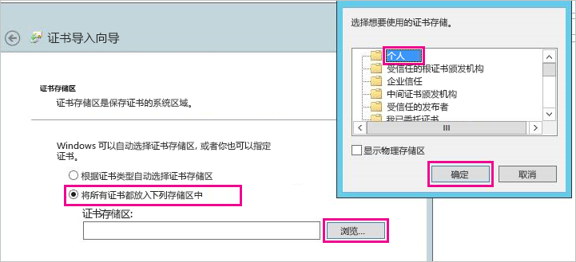
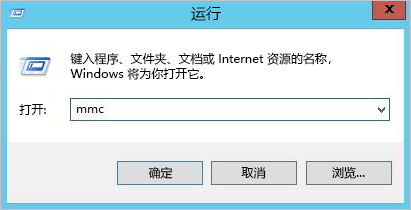
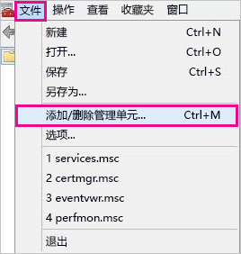

# <a name="use-security-assertion-markup-language-saml-for-single-sign-on-sso-from-power-bi-to-on-premises-data-sources"></a>使用安全断言标记语言 (SAML) 进行从 Power BI 到本地数据源的单一登录 (SSO)

使用[安全断言标记语言 (SAML)](https://www.onelogin.com/pages/saml) 启用无缝单一登录连接。 启用 SSO 后，Power BI 报表和仪表板可以轻松通过本地源刷新数据。

## <a name="supported-data-sources"></a>支持的数据源

目前通过 SAML 支持 SAP HANA。 有关使用 SAML 为 SAP HANA 设置和配置单一登录的详细信息，请参阅 SAP HANA 文档中的 [SAML SSO for BI Platform to HANA](https://wiki.scn.sap.com/wiki/display/SAPHANA/SAML+SSO+for+BI+Platform+to+HANA)（BI 平台到 HANA 的 SAML SSO）。

我们使用 [Kerberos](service-gateway-sso-kerberos.md) 支持其他数据源。

## <a name="configuring-the-gateway-and-data-source"></a>配置网关和数据源

要使用 SAML，首先为 SAML 标识提供者生成证书，然后将 Power BI 用户映射到该标识。

1. 生成证书。 填写公用名时，请确保使用 SAP HANA 服务器的 FQDN。 证书在 365 天内到期。

    ```
    openssl req -newkey rsa:2048 -nodes -keyout samltest.key -x509 -days 365 -out samltest.crt
    ```

1. 在 SAP HANA Studio 中，右键单击 SAP HANA 服务器，然后导航到“安全” > “打开安全控制台” > “SAML 标识提供者” > “OpenSSL 加密库”。

1. 选择“导入”，导航到 samltest.crt，然后导入它。

    

1. 在 SAP HANA Studio 中，选择“安全”文件夹。

    

1. 展开“用户”，然后选择要将 Power BI 用户映射到的用户。

1. 依次选择“SAML”、“配置”。

    

1. 选择在步骤 2 中创建的标识提供者。 对于“外部标识”，输入 Power BI 用户的 UPN，然后选择“添加”。

    

接下来，通过 [xmlsec1 工具](http://sgros.blogspot.com/2013/01/signing-xml-document-using-xmlsec1.html)使用 SAML 断言验证设置。

1. 将下面的断言保存为 assertion-template.xml。 将 \<MyUserId\> 替换为在步骤 7 中输入的 Power BI 用户 UPN。

    ```xml
    <?xml version="1.0" encoding="UTF-8" ?>
    <saml2:Assertion ID="Assertion12345789" IssueInstant="2015-07-16T04:47:49.858Z" Version="2.0" xmlns:saml2="urn:oasis:names:tc:SAML:2.0:assertion">
      <saml2:Issuer></saml2:Issuer> 
      <Signature xmlns="http://www.w3.org/2000/09/xmldsig#">
        <SignedInfo>
          <CanonicalizationMethod Algorithm="http://www.w3.org/TR/2001/REC-xml-c14n-20010315"/>
          <SignatureMethod Algorithm="http://www.w3.org/2000/09/xmldsig#rsa-sha1"/>
          <Reference URI="">
            <Transforms>
              <Transform Algorithm="http://www.w3.org/2000/09/xmldsig#enveloped-signature"/>
              <Transform Algorithm="http://www.w3.org/2001/10/xml-exc-c14n#"/>
            </Transforms>
            <DigestMethod Algorithm="http://www.w3.org/2000/09/xmldsig#sha1"/>
            <DigestValue />
          </Reference>
        </SignedInfo>
        <SignatureValue />
        <KeyInfo>
          <X509Data />
        </KeyInfo>
      </Signature>
      <saml2:Subject>
        <saml2:NameID Format="urn:oasis:names:tc:SAML:1.1:nameid-format:unspecified"><MyUserId></saml2:NameID>
      </saml2:Subject>
      <saml2:Conditions NotBefore="2010-01-01T00:00:00Z" NotOnOrAfter="2050-01-01T00:00:00Z"/>
    </saml2:Assertion>
    ```

1. 运行以下命令。 saltiest.key 和 saml test.crt 是步骤 1 中生成的密钥和证书。

    ```
    xmlsec1 --sign --privkey-pem samltest.key, samltest.crt --output signed.xml assertion-template.xml
    ```

1. 在 SAP HANA Studio 中，打开 SQL 控制台窗口并运行以下命令。 将 \<SAMLAssertion\> 替换为上一步中的 xml 内容。

    ```SQL
    CONNECT WITH SAML ASSERTION '<SAMLAssertion>'
    ```

如果查询成功，表示 SAP HANA SAML SSO 设置成功。

已成功配置证书和标识后，将证书转换为 pfx 格式并配置网关计算机以使用证书。

1. 运行以下命令，将证书转换为 pfx 格式。

    ```
    openssl pkcs12 -inkey samltest.key -in samltest.crt -export -out samltest.pfx
    ```

1. 将 pfx 文件复制到网关计算机：

    1. 双击 samltest.pfx，然后选择“本地计算机” > “下一步”。

    1. 输入密码，然后选择“下一步”。

    1. 选择“将所有证书放入以下存储”，然后选择“浏览” > “个人” > “确定”。

    1. 选择“下一步”，然后选择“完成”。

    

1. 授予网关服务帐户访问证书私钥的权限：

    1. 网关计算机上运行 Microsoft 管理控制台 (MMC)。

        

    1. 在“文件”下，选择“添加/删除管理单元”。

        

    1. 选择“证书” > “添加”，然后选择“计算机帐户” > “下一步”。

    1. 依次选择“本地计算机” > “完成” > “确定”。

    1. 展开“证书” > “个人” > “证书”，然后找到证书。

    1. 右键单击证书并导航到“所有任务” > “管理私钥”。

        

    1. 将网关服务帐户添加到列表中。 默认情况下，帐户是“NT SERVICE\PBIEgwService”。 可以通过运行“services.msc”来找到正在运行网关服务的帐户，并且可以查找“本地数据网关服务”。

        

最后，按照以下步骤向网关配置添加证书指纹。

1. 运行以下 PowerShell 命令列出计算机上的证书。

    ```powershell
    Get-ChildItem -path cert:\LocalMachine\My
    ```
1. 复制创建的证书的指纹。

1. 导航到网关目录（默认为 C:\Program Files\On-premises data gateway）。

1. 打开 PowerBI.DataMovement.Pipeline.GatewayCore.dll.config，找到 SapHanaSAMLCertThumbprint 部分\*\*。 粘贴已复制的指纹。

1. 重启网关服务。

## <a name="running-a-power-bi-report"></a>运行 Power BI 报表

现在，可以使用 Power BI 中的“管理网关”页面配置数据源，并在其“高级设置”下启用 SSO。 然后，可以发布绑定到该数据源的报表和数据集。


## <a name="next-steps"></a>后续步骤

有关“本地数据网关”和 DirectQuery 的详细信息，请查看以下资源：

* [本地数据网关](service-gateway-onprem.md)
* [Power BI 中的 DirectQuery](desktop-directquery-about.md)
* [DirectQuery 支持的数据源](desktop-directquery-data-sources.md)
* [DirectQuery 和 SAP BW](desktop-directquery-sap-bw.md)
* [DirectQuery 和 SAP HANA](desktop-directquery-sap-hana.md)