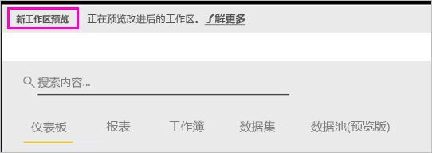
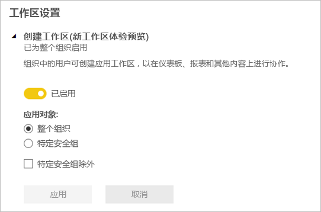

# 组织 Power BI 中的新工作区中的工作（预览）

工作区是与同事协作以创建仪表板和报表集合的地方。 然后可将这些集合捆绑到应用，并可将这些集合分发到整个组织或特定人员或组。 Power BI 以预览的形式引入了新工作区体验。 

使用新的工作区预览，现在可以执行以下操作：

- 将工作区角色分配给用户组：安全组、通讯组列表、Office 365 组和个人。
- 在 Power BI 中创建工作区，而无需创建 Office 365 组。
- 使用更精细的工作区角色在工作区中实现更灵活的权限管理。

详细了解如何[创建一个新工作区](service-create-the-new-workspaces.md)。
 
创建一个新工作区时，无需创建关联的基础 Office 365 组。 所有工作区管理操作都在 Power BI 中进行，而不是在 Office 365 中。 仍可将 Office 365 组添加到工作区，继续通过 Office 365 组管理用户对内容的访问。 不过，还可在 Power BI 中使用安全组、通讯组列表以及直接添加个人，以灵活的方式来管理工作区访问。 因为工作区管理现在在 Power BI 中，所以将由 Power BI 管理员来决定组织中可创建工作区的用户。 在管理门户的“工作区设置”中，管理员可以允许组织中的每个人或无人创建工作区。 管理员还可以限制特定安全组的成员进行创建。

详细了解 [Power BI 管理门户](service-admin-portal.md)。

## 推出新的工作区

在预览期间，新旧工作区可以共存，可以创建其中任意一个。 新工作区预览结束且正式发布时，旧工作区仍可存在一段时间。 用户将无法创建它们，并且需要准备将工作区迁移到新的工作区基础结构。 别担心，有几个月的时间可用来完成迁移。

## 新工作区中的角色

可将用户组或个人作为成员、参与者或管理员添加到新工作区中。 用户组中的每个人都会获得定义的角色。 如果某个人是多个用户组的成员，则其获得角色提供的最高级别的权限。

添加到工作区中的每个人都需要 Power BI Pro 许可证。 在工作区中，这些用户全都可协作处理计划向更广泛的受众，甚至整个组织发布的仪表板和报表。 如果要将内容分发给组织内的其他人，可将 Power BI Pro 许可证分配给这些用户，或将工作区置于 Power BI 高级容量中。

借助角色，可管理哪些人员可在工作区中执行哪些操作，以便实现团队协作。 新的工作区支持向个人和用户组（安全组、Office 365 组和通讯组列表）分配角色。 

向用户组分配角色，组中的个人有权访问内容。 如果嵌套用户组，则包含的所有用户都具有权限。 如果用户属于具有不同角色的多个用户组，则其获得被授予的最高级别的权限。 

新工作区提供三种角色：管理员、成员和参与者。

**管理员可以：**

- 更新和删除工作区。 
- 添加/删除人员，包括其他管理员。
- 执行成员可以执行的所有操作。

**成员可以：** 

- 添加成员或具有较低权限的其他人。
- 发布和更新应用。
- 共享一个项或共享应用。
- 允许其他人重新共享项目。
- 执行参与者可以执行的所有操作。

**参与者可以：** 

- 在工作区中创建、编辑和删除内容。 
- 将报表发布到工作区，删除内容。
- 无法为新用户提供对内容的访问权限。 无法共享新内容，但可以与已与其共享工作空间、项或应用的人员共享。 
- 无法修改组内成员。
 
我们将在整个服务中构建请求访问工作流，以便没有访问权限的用户可以发出请求。 当前存在针对仪表板、报表和应用的请求访问工作流。

## 将旧工作区转换为新工作区

在预览期间，无法自动将旧工作区转换为新工作区。 但是，可以创建新工作区并将内容发布到新位置。 

当新工作区共正式发布 (GA) 后，用户可以选择自动迁移旧工作区。 在 GA 后的某个时刻，必须进行迁移。

## 新工作区与当前工作区有何不同？

我们正在重新设计新工作区的某些功能。 以下是可以预见的对预览版的永久性更改。 

* 创建工作区不会像当前工作区那样在 Office 365 中创建相应的实体。 （仍可以通过为 Office 365 组分配一个角色，将其添加到工作区）。 
* 在当前工作区中，仅可将个人添加到成员和管理员列表中。 在新工作区中，可以向这些列表添加多个 AD 安全组、通讯组列表或 Office 365 组，以便更轻松地管理用户。 
- 可以从当前工作区创建组织内容包。 无法从新工作区创建组织内容包。
- 可以从当前工作区使用组织内容包。 无法从新工作区使用组织内容包。
- 在预览期间，新工作区尚未启用某些功能。 有关详细信息，请参阅下一节[计划的新工作区功能](service-new-workspaces.md#planned-new-workspace-preview-features)。

## 限制和注意事项

要注意的限制：

- 工作区最多可以包含 1,000 个数据集，或每个数据集最多可以包含 1,000 个报表。 
- 具有 Power BI Pro 许可证的人员最多可以成为 250 个工作区的成员。

## 计划的新工作区预览功能

在我们推出预览版时，我们仍在开发某些其他新工作区的预览功能，但这些功能尚不可用：

- 没有“退出工作区”按钮。
- 尚不支持使用情况指标。
- 高级容量工作原理：可以在高级容量中分配和创建工作区，而要在容量之间移动工作区，请转到工作区设置。
- 尚不支持 SharePoint web 部件嵌入。
- 在Office 365 组“获取数据/文件”中，没有“OneDrive”按钮。

## 工作方式不同的工作区功能

新工作区中，某些功能的工作方式与当前工作区不同。 基于客户提供的反馈，这些差异是有意为之，支持更灵活地使用工作空间进行协作：

- 成员可以或无法重新共享：替换为参与者角色
- 只读工作区：不向用户授予对工作区的只读访问权限，而是向用户分配即将推出的查看器角色，该角色允许对工作区中的内容进行类似的只读访问。

## 已知问题

由于这是一项预览功能，因此应注意一些限制。 存在以下已知问题，正在开发修复程序：

- 作为订阅收件人添加到电子邮件的免费用户或用户组可能不会收到电子邮件，尽管他们应该收到这些邮件。 当某一新工作区处于高级容量中，但创建订阅的用户的“我的工作区”不在高级容量中时，会出现此问题。 如果“我的工作区”处于高级容量中，免费用户和用户组都可收到电子邮件。
- 工作区从高级容量迁移至共享容量后，在某些情况下，免费用户和用户组继续接收电子邮件，尽管他们不应收到这些邮件。 当创建订阅的用户的“我的工作区”处于高级容量中时，会出现此问题。

## 后续步骤
* [在 Power BI 中创建新工作区（预览）](service-create-the-new-workspaces.md)
* [创建当前工作区](service-create-workspaces.md)
* [在 Power BI 中安装并使用应用](service-create-distribute-apps.md)
* 是否有任何问题? [尝试咨询 Power BI 社区](http://community.powerbi.com/)
