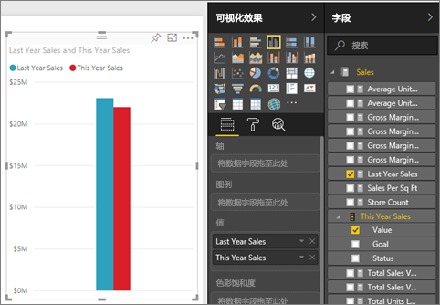
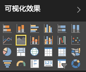

# 基本分区图
基本面积图（又称为分层分区图）基于折线图。 轴和行之间的区域使用颜色进行填充以指示量。 

分区图强调变化随时间推移的度量值，可以用于吸引人们关注某个趋势间的总值。 例如，可以在分区图中绘制表示随时间推移的利润的数据以强调总利润。

## 何时使用基本面积图
基本分区图适用情况：

* 查看并比较各个时序间的量趋势 
* 对于表示可以物理方式计数的集合的各个序列

### 先决条件
 - Power BI 服务
 - 零售分析示例

若要跟着介绍一起操作，请登录 Power BI，并依次选择“获取数据”\>“示例”\>“零售分析示例”>“连接”，再选择“转至仪表板”。 

## 创建基本面积图
 

1. 从“零售分析示例”仪表板中，选择**总商店数**磁贴以打开“零售分析示例”报表。
2. 选择**编辑报表**在编辑视图中打开报表。
3. 选择报表底部的黄色加号图标 (+)，添加新报表页。
4. 创建按月显示本年度销售额和去年销售额的面积图。
   
   a. 在“字段”窗格中，依次选择“销售额”\>“去年销售额”，再依次选择“今年销售额”>“值”。

   

   b.  在“可视化效果”窗格中，选择“分区图”图标，将图表转换为基本分区图。

   
   
   c.  选择“时间”\>“月份”以将其添加到“轴”框。   
   
   
   d.  若要按月显示图表，请选择“省略号”（视觉对象的右上角）并选择“按月排序”。

## 突出显示和交叉筛选
若要了解如何使用“筛选器”窗格，请参阅[向报表添加筛选器](../power-bi-report-add-filter.md)。

若要突出显示图表中的特定分区，请选择相应分区或其上边框。  与其他可视化效果类型不同，如果同一页面上还有其他可视化效果，突出显示基本分区图不会交叉筛选报表页上的其他可视化效果。 但是，面积图是报表页上其他可视化效果触发的交叉筛选的目标。 若要了解详细信息，请参阅[报表中的视觉对象交互](../service-reports-visual-interactions.md)

## 注意事项和疑难解答   
* [残障人士能够更轻松地访问报表](../desktop-accessibility.md)
* 基本面积图对于比较值无效，因为分层区域上是封闭的。 Power BI 使用透明度指示区域的重叠。 但是，它只适用于两个或三个不同区域。 需要将趋势与三个以上的度量值进行比较时，请尝试使用折线图。 需要将量与三个以上的度量值进行比较时，请尝试使用树状图。

## 后续步骤
[Power BI 中的报表](../service-reports.md)  
[Power BI 报表中的可视化效果](power-bi-report-visualizations.md)  
[Power BI - 基本概念](../service-basic-concepts.md)  
更多问题？ [尝试参与 Power BI 社区](http://community.powerbi.com/)

