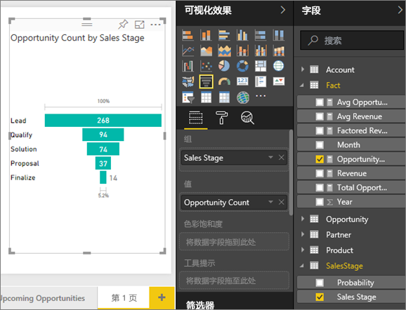
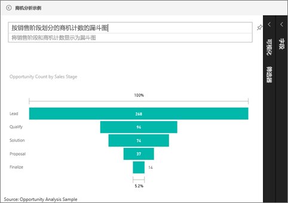

# 漏斗图
漏斗图可帮助你可视化具有顺序连接的阶段的线性流程。 例如，销售漏斗图可跟踪各个阶段的客户：潜在客户 \> 合格的潜在客户 \> 预期客户 \> 已签订合同的客户 \> 已成交客户。  你可以一眼看出漏斗形状传达了你跟踪的流程的健康状况。

漏斗图的每个阶段代表总数的百分比。 因此，在大多数情况下，漏斗图的形状类似于一个漏斗 -- 第一阶段为最大值，每个后一阶段的值都小于其前一阶段的值。  梨形漏斗图也很有用 -- 它可以识别流程中的问题。  但是通常第一阶段，“进入”阶段为最大值。

## 何时使用漏斗图
漏斗图适用情况：

* 数据是有序的，经过至少 4 个阶段。
* 第一阶段“项目”数量预期大于最后一个阶段的数量。
* 要按阶段计算可能的值（收入/销售额/交易/等等）。
* 要计算并跟踪转化率和保留率。
* 要揭示线性流程中的瓶颈。
* 要跟踪购物车工作流。
* 要跟踪点击广告/市场营销活动的进度和成功率。

## 使用漏斗图
漏斗图：

* 可以从报表和问答中固定。
* 可以进行排序。
* 支持多个漏斗图。
* 可以由相同报表页上的其他可视化效果来突出显示和交叉筛选。
* 可以用来突出显示和交叉筛选相同报表页上的其他可视化效果。

## 创建基本漏斗图
观看这段视频了解如何使用销售和市场营销示例创建漏斗图。

<iframe width="560" height="315" src="https://www.youtube.com/embed/qKRZPBnaUXM" frameborder="0" allow="autoplay; encrypted-media" allowfullscreen></iframe>

现在让我们创建自己的漏斗图，该图用于显示在每个销售阶段我们所拥有的机会数。

以下说明使用机会分析示例。 若要继续学习，请[下载](../sample-datasets.md)适用于 Power BI 服务 (app.powerbi.com) 或 Power BI Desktop 的示例。   

1. 从[空白报表页](../power-bi-report-add-page.md)开始，选择“SalesStage”\>“销售阶段”字段。 如果使用的是 Power BI 服务，请确保在 [“编辑视图”](../service-interact-with-a-report-in-editing-view.md) 中打开报表。
   
    
2. [将图表转换](power-bi-report-change-visualization-type.md)漏斗图。 请注意，**销售阶段**位于**组**框中。 
3. 从**字段**窗格中选择**事实** \> **机会计数**。
   
    
4. 将鼠标悬停在条形图上可显示大量的信息。
   
   * 阶段的名称
   * 当前在此阶段的机会数
   * 总体转化率（潜在客户的百分比） 
   * 一个阶段到另一个阶段的转化率（又称丢弃率）是指占上一阶段的百分比（在该例中为建议阶段/解决方案阶段）
     
     
5. [将漏斗图添加为仪表板磁贴](../consumer/end-user-tiles.md)。 
6. [保存报表](../service-report-save.md)。

## 突出显示和交叉筛选
有关使用筛选器窗格的信息，请参阅[向报表添加筛选器](../power-bi-report-add-filter.md)。

突出显示漏斗图中的某个条可交叉筛选报表页上的其他可视化效果，反之亦然。 若要遵循此示例，请向包含漏斗图的报告页中再添加几个视觉对象。

1. 在漏斗图中，选择“建议”条。 这样可以交叉突出显示页面上的其他可视化效果。 使用 CTRL 键可选择多个。
   
   
2. 若要设置视觉对象如何相互交叉突出显示和交叉筛选的首选项，请参阅 [Visual interactions in Power BI（Power BI 中的可视化交互）](../consumer/end-user-interactions.md)

## 在问答中创建漏斗图
打开“机会分析示例”仪表板，或者至少包含一个从“机会分析示例”数据集固定的可视化对象的任何其他仪表板。  在问答中键入一个问题时，Power BI 将在与所选仪表板关联（具有固定到所选仪表板的磁贴）的所有数据集中搜索答案。 有关详细信息，请参阅 [Power BI - basic concepts（Power BI - 基本概念）](../consumer/end-user-basic-concepts.md)。

1. 在“机会分析示例”仪表板中，开始在“问答”问题框中键入问题。
   
   
   
2. 请务必将其添加为“漏斗”，以便 Power BI 知道你希望使用哪个可视化效果类型。

## 后续步骤
[Power BI 中的可视化效果类型](power-bi-visualization-types-for-reports-and-q-and-a.md)

[将可视化效果固定到仪表板](../service-dashboard-pin-tile-from-report.md)

[Power BI - 基本概念](../consumer/end-user-basic-concepts.md)

更多问题？ [尝试参与 Power BI 社区](http://community.powerbi.com/)

