# 关键影响因素可视化效果
关键影响因素视觉对象有助于理解驱动你所关注指标的因素。 它可分析数据，对重要因素进行排序，并将其显示为“关键影响因素”。 例如，你想了解影响员工流动（流失）的因素。 一大因素可能是就业合同时限，另一大因素可能是员工年龄。 
 
## 何时使用关键影响因素？ 
关键影响因素视觉对象对以下操作来说是个不错之选： 
- 查看影响所分析指标的因素。

- 对比这些因素的相对重要性。 例如，短期合同比长期合同对流失的影响更大吗？ 

## 关键影响因素要求 
所分析指标必须是类别字段。    

## 关键影响因素视觉对象的功能

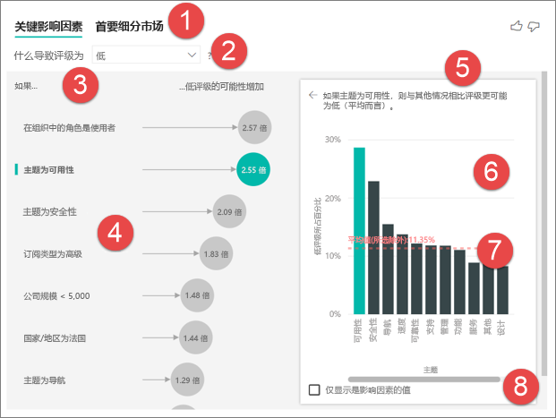    

1. ***选项卡*** - 选择选项卡以在视图之间进行切换。 关键影响因素显示所选指标值的首要参与者。 首要细分市场显示对所选指标值有贡献的首要细分市场。 “细分市场”由值的组合组成。  例如，某一细分市场可能已成为客户至少 20 年，他们居住在西部地区。 

2. ***下拉列表*** - 所调查指标的值。 在此示例中，我们看到的是指标“评级”，而所选择的值为“低”。    

3. ***重述*** - 帮助解释左窗格中的视觉对象。 

4. ***左窗格*** - 左窗格包含一个视觉对象。  在此情况下，左窗格显示首要关键影响因素列表。

5. ***重述*** - 帮助解释右窗格中的视觉对象。

6. ***右窗格*** - 右窗格包含一个视觉对象。 在此情况下，列图显示左窗格中已选中“关键影响因素，主题”的所有值。 左窗格中的特定值（“可用性”）为绿色，而“主题”的所有其他值为黑色。

7. ***平均线*** - 除可用性以外，已计算“主题”的所有其他可能值的平均值。 因此该计算适用于所有黑色的值。 这可告知其他“主题”给我们低评级的可能性。 换言之，客户给出评级时，该客户还会说明该评级的原因或“主题”。 某些主题是可用性、速度、安全性等。根据左窗格中的视觉对象，“主题”为“可用性”是导致低评级的第二大关键因素。 如果对所有其他主题以及对其导致低评级的影响程度进行平均，我们就会得到此处以红色显示的结果。 

8. ***复选框*** - 仅显示是影响因素的值。

## 创建关键影响因素视觉对象 
 
观看此视频了解如何创建关键影响因素视觉对象，然后按照以下步骤自行创建一个。 

<iframe width="560" height="315" src="https://www.youtube.com/embed/fDb5zZ3xmxU" frameborder="0" allow="accelerometer; autoplay; encrypted-media; gyroscope; picture-in-picture" allowfullscreen></iframe>

我们的产品经理希望找出哪些因素会导致客户对云服务进行负面评论。  若要继续了解，请打开 Power BI Desktop 中的[客户反馈 .PBIX 文件](https://github.com/Microsoft/powerbi-desktop-samples/blob/master/2019/customerfeedback.pbix)。 也可以下载 [Power BI 服务 或 Power BI Desktop 的客户反馈 Excel 文件](https://github.com/Microsoft/powerbi-desktop-samples/blob/master/2019/customerfeedback.xlsx)。 

> [!NOTE]
> 客户反馈数据集基于 [Moro et al., 2014] S. Moro, P. Cortez and P. Rita. A Data-Driven Approach to Predict the Success of Bank Telemarketing. Decision Support Systems, Elsevier, 62:22-31, June 2014 

1. 打开报表并选择“关键影响因素”图标。  

    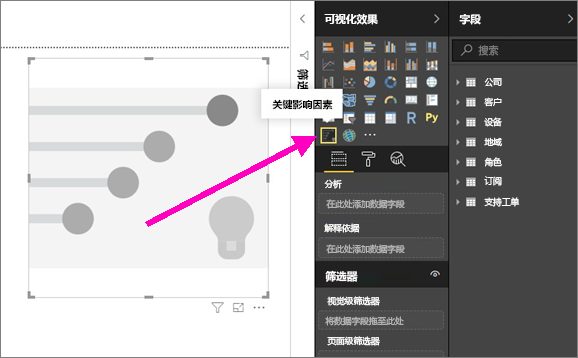

2. 将要研究的指标拖动到“分析”字段。 “分析”字段仅支持分类（非连续）变量。 由于我们想要了解导致客户对服务的评级为“低”的原因，因此选择“客户表” > “评级”。    
3. 接下来，将认为可能影响评级的字段拖到“解释依据”区域。 可以根据需要拖入多个字段。 在此情况下，我们从以下字段开始： 
    - 国家/地区 - 区域 
    - 在组织中的角色 
    - 订阅类型 
    - 公司规模 
    - 主题     
4. 由于我们关注的是负面评级，因此选择“什么导致评级为”下拉列表中的“低”。  

    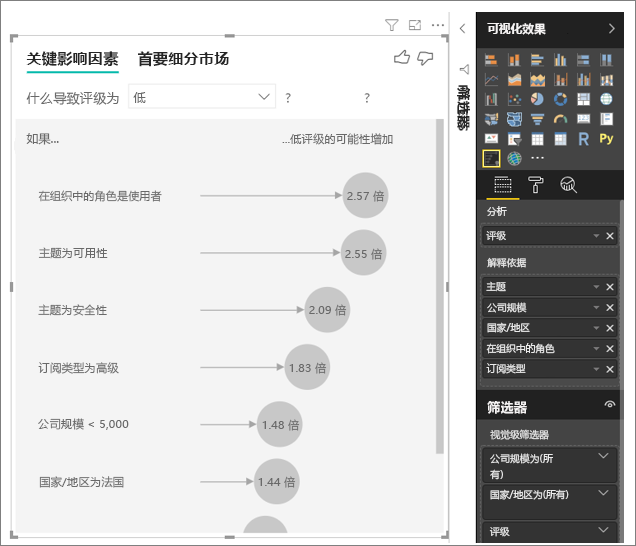

分析在所分析字段的表级别上运行。 在此情况下，我们关注的是“评级”指标，该指标是在客户级别上定义的（每位客户给出了高分或低分）。 我们所有的解释因素都必须以客户级别进行定义，以便视觉对象可进行利用。 

在上述示例中，我们所有的解释因素与指标均为一对一或多对一关系。 例如，每个评分正好具有一个与之相关的主题（即客户评价的主要主题）。 同样，来自同一国家/地区的客户在其组织中具有同一成员身份类型和同一角色。 因此，我们的解释因素已经是客户属性，无需转换 – 视觉对象可以立即使用它们。 

在本教程的后面部分，我们将介绍较为复杂的示例，其中具有一对多关系。 在这些情况下，必须首先将列向下聚合到客户级别，然后才能运行分析。  

用作解释因素的度量值和聚合也在“分析”指标的表级别进行评估，本文后面部分将提供一些示例。 

## 解释分类关键影响因素 
我们来看看导致低评级的关键影响因素。 

### 影响低评级可能性的第一大因素

在组织中，我们有三种角色：客户、管理员和发布者。 我们发现，客户是导致低评级的首要因素。 

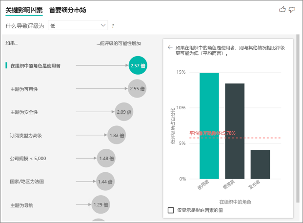

更准确地说，客户留下负面评分的可能性是 2.57 倍。 关键影响因素图表先在左侧列表中列出“在组织中的角色是客户”。 通过选择“在组织中的角色是客户”，Power BI 在右侧窗格上显示更多细节，即每个“角色”对低评级可能性的相对影响。
  
- 14.93% 的客户给出低分  
- 平均来看，5.78% 的所有其他角色给出了低分 
- 因此，与所有其他角色相比，客户给出低分的可能性为 2.57 倍（即绿条和红色虚线之间的差额） 

### 影响低评级可能性的第二大因素

关键影响因素视觉对象能够比较许多不同变量的因素并对其进行排列。  第二影响因素与“在组织中的角色”无关。选择列表中的第二影响因素：“主题为可用性”。 

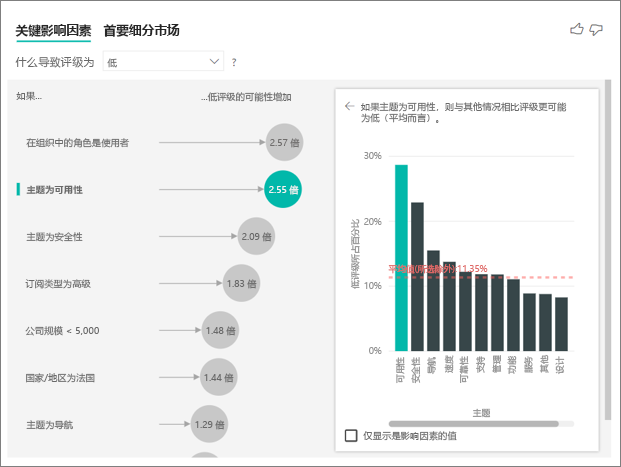

此处我们发现第二重要因素与客户评价的主题相关。 与对可靠性、设计或速度等其他主题发表评论的客户相比，对产品可用性发表评论的客户给出低分的可能性为 2.21 倍。 

从视觉对象之间可以看出，平均值（红色虚线）已从 5.78% 变为 11.34%。 平均值是动态的，因为该值基于所有其他值的平均值。 就第一影响因素而言，平均值排除了客户角色，而第二影响因素，则排除了可用性主题。 
 
勾选视觉对象底部的框会使视觉对象仅筛选有影响的值（本例中即为导致低分的角色）。 因此，我们从关注 12 个主题，转变为关注已认定为导致低评级的 4 个 Power BI。 

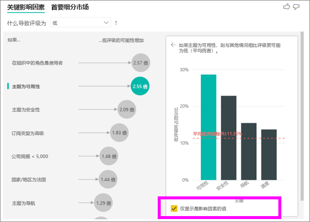

## 与其他视觉对象交互 
 
每当用户单击画布上的切片器、筛选器或其他视觉对象时，关键影响因素视觉对象就会重新运行对新数据部分的分析。 例如，将“公司规模”拖到报表，并用作切片器。 我们想知道企业客户（公司规模大于 50,000 人）的关键影响因素是否不同于一般人群。  
 
选择“> 50000”会重新运行分析，可以看到影响因素已发生变化。 对于大型企业客户，低评级的首要影响因素具有与安全性相关的主题。 我们可能需要进一步调查，从而了解是否存在大型客户不满意的特定安全功能。 

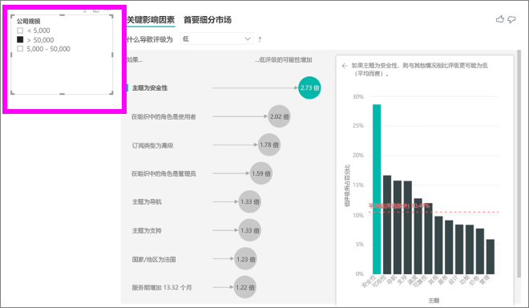

## 解释持续关键影响因素 
 
到目前为止，我们已使用视觉对象来探索不同分类字段影响低评级的方式。 将连续因素（例如年龄、身高、价格）纳入“解释依据”也有可能。 我们来看看将客户表中的“服务期”纳入“解释依据”时会发生什么情况。 “服务期”表明客户已使用服务的时间。 
 
我们发现，随着“服务期”变长，获得低评级的可能性也在增加。 这一趋势表明，长期客户实际上更有可能给出负面评分，这是一个有趣的见解，并且以后可能需要继续跟进。  
 
可视化效果告诉我们，每当服务期延长 13.44 个月，低评级的可能性平均增加 1.23 倍。 在此情况下，13.44 个月表示服务期的标准差。 所以我们得到的见解着眼于按标准数额（服务期标准差）增加服务期会如何影响收到低评级的可能性。 
 
右侧散点图绘制了每个服务期值的低评级平均百分比，且包括突出斜率的趋势线。  

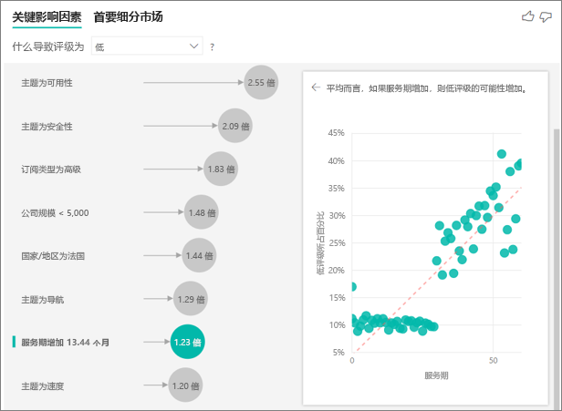

## 将度量值/聚合作为关键影响因素进行解释 
 
最后，用户还可以将度量值和聚合用作其分析中的解释因素。 例如，我们可能想要了解客户支持工单计数或开放式工单的平均持续时间对所得评分的影响。 
 
在此情况下，我们想知道客户拥有的支持工单数量是否会影响其给出的分数。 我们将从支持工单表中引入支持工单 ID。 由于客户可拥有多个支持工单，因此我们需要将 ID 聚合到客户级别。 此聚合非常重要，因为我们在客户级别上运行分析，因此需要在该粒度级别上定义所有因素。 
 
我们将查看 ID 计数（因此每个客户行将具有与之关联的支持工单计数）。 在此情况下，我们看到，随着支持工单计数的增加，低评级的可能性增加了 5.51 倍。 右侧视觉对象显示了按不同评级值（在客户级别上评估）划分的支持工单的平均计数。 

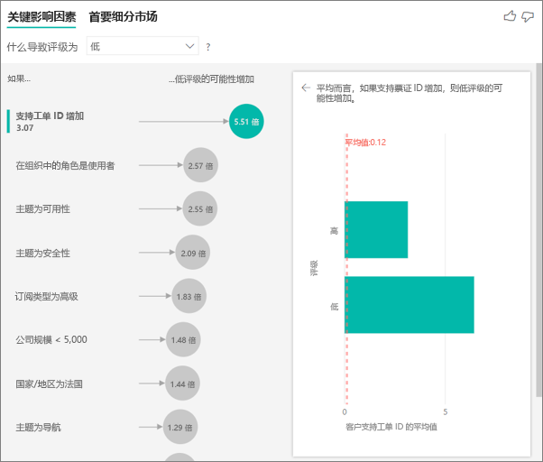

## 解释结果：首要细分市场 
 
虽然用户可使用“关键影响因素”选项卡单独评估每个因素，但用户可以切换到“首要细分市场”，以便了解因素组合如何影响他们所分析的指标。 
 
首要细分市场最初显示了 Power BI 已发现所有细分市场的概述。 在以下示例中，我们可以看到已找到六个细分市场。 这些细分市场是按该市场低评级的百分比进行排序的。 例如，我们看到细分市场 1 客户的低评级百分比为 74.3%。  气泡越高，低评级的比例就越高。 另一方面，气泡尺寸表示该细分市场中的客户数量。 

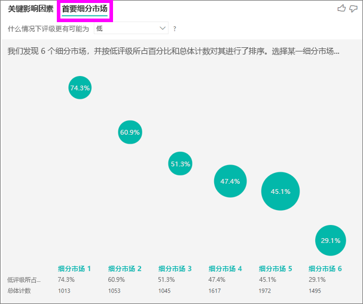

选择气泡可了解该细分市场的详细信息。 例如，如果我们选择细分市场 1，我们会发现该市场由相对长期的客户（已经同我们共事 29 个月以上）组成，这些客户拥有大量支持工单（大于 4 张）。 最后，他们并不是发布者（因此是客户或管理员）。  
 
在此组中，74.3% 已给出低评级。 此时给出低评级的普通客户的百分比为 11.7%，所以此细分市场的低评级比例要高得多（高出 63 个百分点）。 我们还发现细分市场 1 包含大约 2.2% 的数据，因此可表示总体中的可处理部分。 

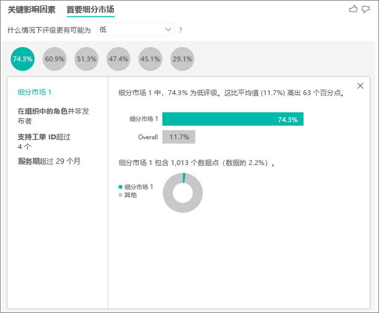

## 注意事项和疑难解答 
 
**预览版的限制是什么？** 
 
关键影响因素视觉对象目前为公共预览版，用户应该注意几个限制。 当前不可用的功能包括： 
- 分析为聚合/度量值的指标 
- 在 Power BI Embedded 中使用视觉对象
- 在 Power BI 移动应用上使用视觉对象
- RLS 支持 
- 直接查询支持 
- 实时连接支持 
 
**出现了错误：未找到影响因素/细分市场。这是为什么？**  

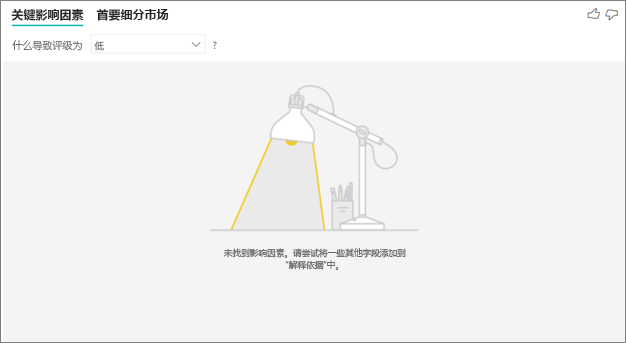

“解释依据”中已包含字段但未找到影响因素时，便会出现此错误。   
- “分析”和“解释依据”中已包含所分析的指标（应将其从“解释依据”中删除） 
- 解释字段具有太多类别，而只有少量观测数据。 这导致可视化效果很难确定哪些因素是影响因素，因为很难基于少量观测数据对事物进行归纳 
- 解释因素具有足够的观测数据来进行归纳，但可视化效果并未发现任何有意义的相关性来向其报告 
 
**出现了错误：我分析的指标没有足够数据运行分析。这是为什么？**  

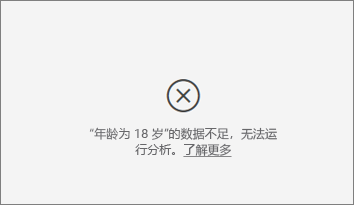

可视化效果的工作原理是：查看某组（例如，给出低评级的客户）相对于其他组（例如，给出高评级的客户）在数据中的模式。 如果模型中的数据只有少量观测数据，则很难发现模式。 如果可视化效果没有足够数据查找有意义的影响因素，将表示需要更多数据运行分析。 我们建议针对所选状况至少具有 100 个观测数据（客户流失），而针对用于对比的状况至少具有 10 个观测数据（客户未流失）。  
 
**出现了错误：“解释依据”中的字段与包含所分析指标的表并不唯一相关。这是为什么？**  
 
分析在所分析字段的表级别上运行。 例如，如果分析的是客户对服务的反馈，则可能具有一个表，该表可告知客户给出了高评级或低评级。 在此情况下，分析将在客户表级别运行。 

如果具有相关表，同时该表是以比包含指标的表更精细的级别进行定义的，则将出现此错误。 我们通过示例来说明： 
 
- 你在分析导致客户对服务给出低评级的原因 
- 你想要查看客户使用服务的设备是否会影响给出的评价 
- 客户可以通过多种不同方式使用服务   
- 在下面的示例中，客户 10000000 使用浏览器和平板电脑与服务交互 

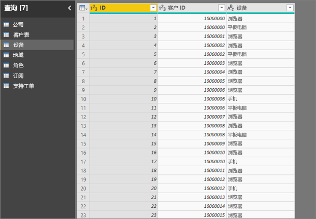

如果尝试使用设备列作为解释因素，则将出现以下错误： 

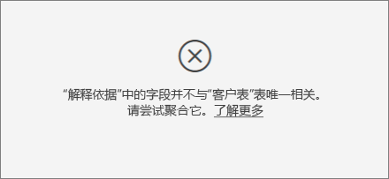

这是由于设备不是在客户级别定义的，一位客户可以在多个设备上使用服务。 若要使可视化效果可查找模式，设备需要成为客户属性。 在此情况下，根据对业务的了解，我有几种解决方案： 
 
- 例如，如果我认为设备数量可能会影响客户给出的分数，我可以将设备摘要更改为计数 
- 我可以透视设备列，查看在特定设备上使用服务是否会影响客户评级  
 
在此示例中，我透视数据以创建“浏览器”、“手机”和“平板电脑”的新列。 我现在可以在“解释依据”中使用这些列。 我们发现，所有设备都是影响因素，而浏览器对客户评分的影响最大。 

更准确地说，不通过浏览器使用服务的客户比通过浏览器使用服务的客户给出低分数的可能性高 3.79 倍。 我们在列表下方看到，对手机而言，相反情况也可成立。 使用移动应用的客户比不使用移动应用的客户更可能给出低分。  

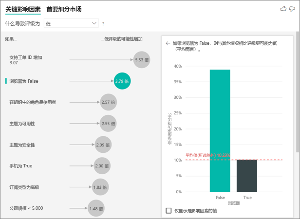

**出现了警告：度量值未包含在分析中。这是为什么？** [2052261] 

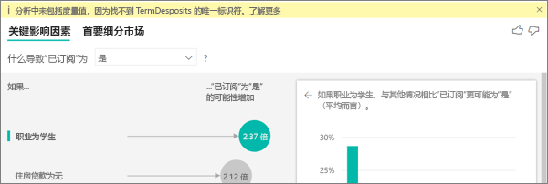

分析在所分析字段的表级别上运行。 如果分析的是客户流失，可能会有表格告知是否有客户流失。 在此情况下，分析将在客户表级别运行。
 
默认情况下，在该表级别分析度量值和聚合。 如果存在“每月平均支出”度量值，则将在客户表级别对其进行分析。  

如果客户表没有唯一标识符，我们就不能对度量值进行评估，分析也会将其忽略。 为避免此情况，请确保具有指标的表（本例中为客户表）具有唯一标识符（例如，客户 ID）。 使用 Power Query 添加索引列也非常轻松。
 
**出现了警告：所分析指标具有 10 个以上唯一值，这可能会影响分析质量。这是为什么？**  

AI 可视化效果针对分析类别进行了优化（例如，流失为“是”或“否”、客户满意度为“高”、“中”或“低”等）增加要分析的类别数量意味着每个类别的观测数据更少，这使可视化效果在数据中查找模式变得更难。 

为了查找更强的影响因素，我们建议将类似值组合到一个单元中。 例如，如果有价格指标，则通过将类似价格分组为“高”、“中”、“低”类别，而不是使用单独的价格点，可能会获得更好的结果。 

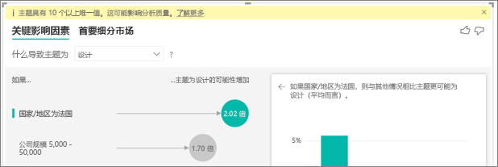

**数据中的一些因素看起来应该是关键影响因素，但并非如此。为何出现这种情况？**

在以下示例中，我们看到作为使用者的客户会给出低评级（14.93% 为低评级）。 有趣的是，管理员角色也有很高比例的低评级 (13.42%)，但未将其视为影响因素。 

究其原因是，查找影响因素时可视化效果还会考虑数据点数量。 在以下示例中，我们拥有超过 29,000 名客户和少于其十分之一的管理员（约 2,900 人）。 此外，其中仅 390 人给出低评级。 因此，视觉对象没有足够数据来确定是否真的凭借管理员评级找到了模式，或者是否只是偶然找到。  

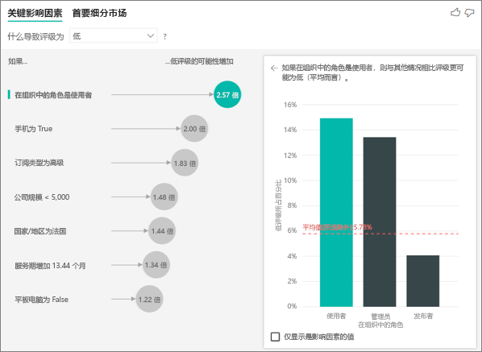

**如何计算关键影响因素？**

AI 可视化效果使用 [ML.NET](https://dotnet.microsoft.com/apps/machinelearning-ai/ml-dotnet) 在后台运行逻辑回归来计算关键影响因素。 逻辑回归是统计模型，用于相互比较不同的组。 如果要找出导致低评级的原因，逻辑回归会查找给出低评级的客户与给出高评级的客户之间的区别。 如果有多种类别（高分、中分、低分），我们将找出给出低分的客户与未给出低分的客户之间的区别（他们与给出高评级或中评级的客户之间的区别）。 
 
逻辑回归在数据中搜索模式，查找给出低评级的客户与给出高评级的客户之间的区别。 例如，逻辑回归可能会发现，与拥有很少或没有支持工单的客户相比，拥有更多支持工单的客户给出低评级的百分比要高得多。
 
逻辑回归还会考虑存在的数据点数量。 例如，如果具有管理员角色的客户给出负面分数的比例更高，但由于管理员数量很少，便不会将其视为影响因素。 这是因为没有足够的可用数据点来推断模式。 统计检验（Wald 检验）用于确定是否将某因素视为影响因素。 视觉对象使用 0.05 的 p 值确定阈值。 

**如何计算细分市场？**

AI 可视化效果使用 [ML.NET](https://dotnet.microsoft.com/apps/machinelearning-ai/ml-dotnet) 在后台运行决策树查找关注的子组。 决策树的目标是最终得到在关注的指标中相对高的数据点子组（例如，给出低评级的客户）。 

决策树采用每个解释因素，并试图推断出将给出最佳“分支”的因素。 例如，如果将数据筛选为仅包含大型企业客户，是否可将给出高评级的客户与给出低评级的客户区分开来？ 或者，如果将数据筛选为仅包含评论了安全性的客户，情况是否可能更好？ 

决策树进行分支后，便会采用该数据子组（例如，评论了安全性的客户），并尝试找出该数据的下一个最佳分支。 每次分支后，还会考虑是否有足够的数据点使其成为具有代表性的组来推断模式，或者是否只是数据中的异常，因此并非真正的细分市场。 （另一种统计检验适用于 p 值为 0.05 时检查分支条件的统计学意义）。 

决策树完成运行后，将采用所有分支（安全评论、大型企业）并创建 Power BI 筛选器。 此筛选器组合打包为视觉对象中的细分市场。 
 
**为什么将更多字段拖进“解释依据”时，某些因素会成为影响因素/不再是影响因素？**

可视化效果同时评估所有解释因素。 这意味着，尽管某因素本身可能是影响因素，但同其他因素一起考虑时，则可能不是影响因素。 想象一下，我们在分析导致房价高的原因，卧室和房子大小是解释因素： 
- 就其本身而言，更多的卧室可能是房价高的驱动因素 
- 在分析中纳入房屋大小意味着，我们现在可以了解在房屋大小不变的情况下，卧室会有何变化 
- 如果将房屋面积固定为 1500 平方英尺， 卧室数量持续增加将不太可能导致房价急剧上涨。与考虑房子大小之前相比，卧室可能并非如此重要的因素。 

## 后续步骤
[Power BI 中的组合图表](power-bi-visualization-combo-chart.md)

[Power BI 中的可视化效果类型](power-bi-visualization-types-for-reports-and-q-and-a.md)
