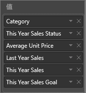
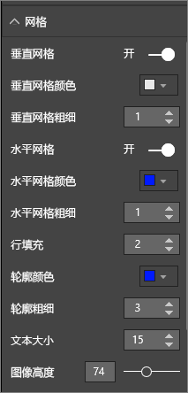
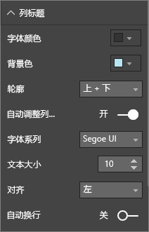
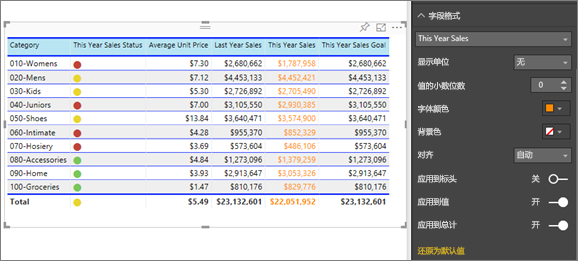
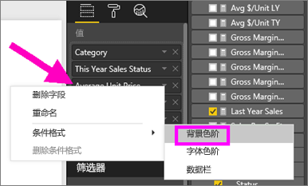
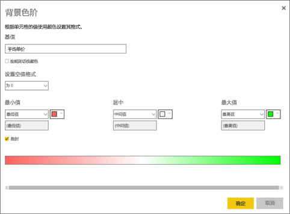
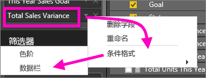
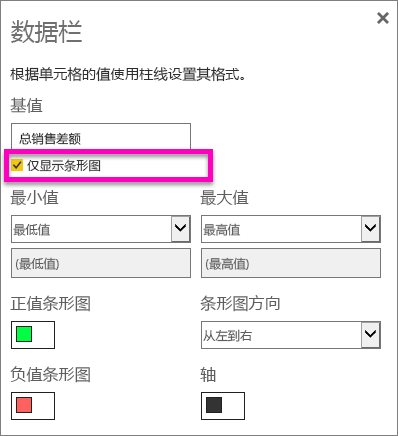
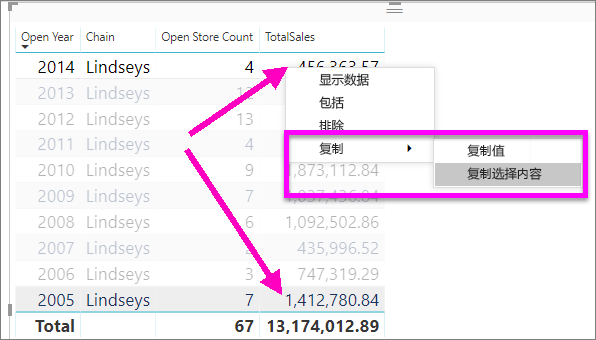

# Power BI 报表和仪表板中的表
表是以逻辑序列的行和列表示的包含相关数据的网格。 它还包含标头和合计行。 表格可以进行数量比较，可以在其中查看单个类别的多个值。 例如，该表显示了**类别**的 5 个不同的度量值。

在报表中创建表，并将表内元素与同一报表页面上的其他视觉对象进行交叉突出显示。  此外，还可以选择行、列和各个单元格进行交叉突出显示。 可将单个单元格和多个单元格选择复制并粘贴到其他应用程序。

## 何时使用表
在以下情况下选择表是不错的选择：

* 查看并比较详细数据和精确值（而不是可视化表示形式）时
* 以表格格式显示数据时
* 按类别显示数值数据时   

> [!NOTE]
> 如果表格具有过多值，请考虑将其转换为矩形图和/或使用向下钻取。 表格显示的最大数据点数为 3,500。

## 先决条件
- Power BI 服务或 Power BI Desktop
- 零售分析示例

## 创建表
我们将创建上图所示的表，以按项目类别显示销售值。 若要跟着介绍一起操作，请登录 Power BI 服务，并依次选择“获取数据”**\>“示例”\>“零售分析示例”>“连接”**，再选择“转至仪表板”。 创建可视化效果需要对数据集和报表拥有编辑权限。 幸运的是，所有 Power BI 示例都是可以编辑的。 如果报表已与你共享，则无法在报表中创建可视化效果。

1. 在左侧导航窗格中，选择“工作区 > 我的工作区”。    
2. 选择“数据集”选项卡，然后向下滚动到你刚才添加的“零售分析示例”数据集。  选择“创建报表”图标。

    
2. 在报表编辑器中，选择“项” > “类别”。  Power BI 会自动创建一个表，该表列出所有类别。

    
3. 选择“**销售 > 平均单价**和“**销售 > 去年销售额**”以及“**销售 > 本年度销售额**”，并选择所有 3 个选项（值、目标和状态）。   
4. 在可视化效果窗格中，找到“**值**”一列并拖放值，直到图表列的顺序与该页的第一个图像相匹配。  “值”列应如下所示。

    
5. 通过选择大头针图标将该表固定到仪表板  

     

## 设置表格格式
有多种设置表格格式的方法，这里只介绍其中几种。 若要了解其他格式设置选项，请打开“格式设置”窗格（滚动油漆刷图标 ）并进行浏览。

* 尝试设置表格中网格的格式。 此处我们已添加蓝色垂直网格，为行添加了空间，并稍微增加了边框和文本的大小。

    

    
* 对于列标题，我们更改了背景色、添加了边框，并增加了字体大小。 

    

    

* 甚至可以将格式设置应用于单个列和列标题。 首先展开“字段格式设置”，并从下拉列表选择要设置格式的列。 根据列值，字段格式设置允许你设置以下内容：显示单位、字体颜色、小数位数、背景、对齐方式等等。 在调整设置后，确定是否将这些设置应用到标头和总计行。

    

* 进行了一些其他格式设置后，最终表格如下。 由于格式设置选项较多，最好的了解方法是从默认信息入手，打开“格式设置”窗格 ，然后开始浏览。 

    

### 条件格式
一种类型的格式设置称为条件格式设置，可应用于 Power BI 服务或桌面的“可视化效果”窗格的“值”框的字段中。 

通过表的条件格式设置，可以根据单元格值指定自定义单元格背景色和字体颜色，包括使用渐变色。 

1. 在 Powr BI Desktop 服务或桌面的“可视化效果”窗格中，在要设置其格式的“值”框中，选择值旁边的向下箭头（或右键单击该字段）。 只能管理“字段”格的“值”区域中字段的条件格式。

    
2. 选择“背景色阶”。 在随即显示的对话框中，可以配置颜色，以及最小和最大值。 如果选择“散射”框，还可以配置一个可选的“居中”值。

    

    我们将某些自定义格式设置应用于“平均单价”值。 选择“散射”，添加一些颜色，然后选择“确定”。 

    
3. 将新字段添加到具有正值和负值的表中。  选择“销售额”>“总销售差额”。 

    
4. 添加数据条条件格式设置，方法是选择“总销售差额”旁边的向下箭头，然后选择“条件格式设置”>“数据条”。

    
5. 在出现的对话框中，依次设置“正值条形图”、“负值条形图”的颜色，在“仅显示数据条”旁边放置一个选中标记，并进行所需的任何其他更改。

    

    当选择“确定”时，数据条会替换表格中的数字值，使其更易于扫描。

    
6. 若要从可视化效果中删除条件格式，只需再次右键单击该字段，并选择**删除条件格式**即可。

> [!TIP]
> 还可以在“格式设置”窗格（滚动油漆刷图标）中进行条件格式设置。 选择要设置其格式的值，然后将“色阶”或“数据条”设置为“打开”以应用默认设置，或者，若要自定义设置，请选择“高级控件”。
> 
## 复制 Power BI 表中的值以供在其他应用程序中使用

表或矩阵可能具有你想要在其他应用程序中使用的内容，例如 Dynamics CRM、Excel、甚至其他 Power BI 报表。 通过右键单击 Power BI，可以将单个单元格或选定的单元格复制到剪贴板，并粘贴到其他应用程序。

* 若要复制单个单元格的值，选择单元格，右键单击，并选择“复制值”。 现在可以将此剪贴板上未格式化的单元格值粘贴到其他应用程序。

    

* 若要复制多个单元格，选择单元格范围或使用 CTRL 来选择一个或多个单元格。 复制将包括列标题和行标题。

    

    复制包括列标题和行标题。

    

## 调整表的列宽度的大小
有时 Power BI 会截断仪报表中或仪表板上的列标题。 若要显示整个列名称，将鼠标悬停在标题右侧的空白处以显示双箭头，然后选择并拖动它。

## 注意事项和疑难解答
* 应用列格式时，每列只能选择一个对齐选项：自动、左对齐、居中和右对齐。 通常情况下，一个列包含的内容全部为文本或全部为数字，而不是二者的混合。 但如果某列同时包含数字和文本，选择“自动”选项时，文本左对齐、数字右对齐。 此行为支持从左往右阅读的语言。   

## 后续步骤

[Power BI 中的树状图](power-bi-visualization-treemaps.md)

[Power BI 中的可视化效果类型](power-bi-visualization-types-for-reports-and-q-and-a.md)